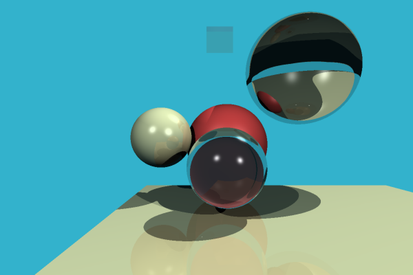

# rayboi

A meh raytracer implemented in Python.

The performance is most certainly not where I want it to be. I have a feeling
I can get significantly better performance with a bit of tuning of the numpy
functions I used.

Future improvements/projects:

* Model loading
* Texture mapping
* Spatial partitioning (e.g. kdtree or [BVH](https://raytracing.github.io/books/RayTracingTheNextWeek.html))
* [PBRT](http://www.pbr-book.org/3ed-2018/contents.html)
* Raytrace on the GPU? Maybe with [Futhark](https://futhark-lang.org/)
  [Python bindings](https://futhark-lang.org/blog/2016-04-15-futhark-and-pyopencl.html)?
